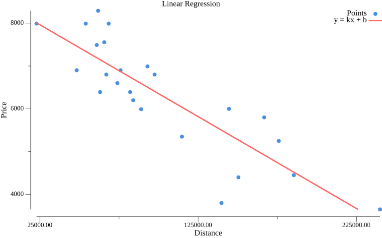

# ft_linear_regression

A linear regression implementation in Go, built as part of the 42 cursus.  
The model learns the relationship between a car's mileage and its price using gradient descent on normalized data.



## Build

```bash
make all
```

Produces three binaries: `train`, `predict`, `precision`.

## Usage

### 1. Train

Reads a CSV file (`km,price`), runs gradient descent, and saves the learned weights to `weights.json`.

```bash
./train data.csv
```

### 2. Predict

Loads `weights.json` and estimates the price for a given mileage.

```bash
./predict 100000
# Estimated price for 100000 km: 6354.70
```

### 3. Precision

Loads `weights.json`, runs predictions against the dataset, and reports model accuracy.

```bash
./precision data.csv
# Precision: 91.47%
```

## Clean

```bash
make fclean   # remove binaries and weights.json
make re       # fclean + rebuild
```
